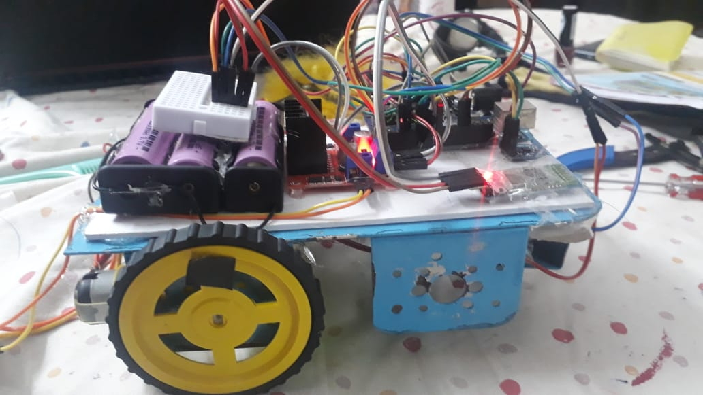

# digit_recognition_with_point_to_point_translation

# IDEA :

   The main idea of the project is that I will be drawing numbers in air Infront of a camera and will try to figure out the respective digits from the captured frames with the use of deep learning concepts. So these numbers represent the coordinates to which a bot as to move .hence these coordinates are sent to the bot serially and it translates to the respective coordinates based on its current location.
This can be used in automated translation.

# PRIMARY:
   The primary task is classified into 3 sub tasks
# i) PHASE 1 :-
   Capturing the free hand drawing of the digit in air by lap camera using OpenCV Python
# Task 1:
• I will do a separate capture of x and y coordinates by drawing in the air with a marker or anything to threshold with. (eg. 1st I will draw the y with a blue colour marker in air, capture it and store the image then for x separately ).
• Then saving the images containing the coordinates in black and white or binary format(using the required operations with OpenCV like thresholding).
# Task 2:
• In this I will be drawing the x and y coordinates at the same time continuously by separating with a comma and will extract the image representing x and y coordinates separately with ROI or any other method (eg. I will draw “2,3“ in the air so it will try to extract the image containing the x and y values separately) .
• Then saving the images containing the coordinates in binary format(using the required operations with OpenCV like thresholding ).
# ii) PHASE 2 :- Digit recognition using deep learning and Python
• By using the MINST dataset I will train a model to recognise the digit in the images retrieved from the previous part(OpenCV) and display the corresponding coordinates and also store them is specific variable.
# iii) PHASE 3 :- Establishing Serial Communication(Bluetooth) and Translation of bot to the required location
• So now the coordinates found by the model is transmitted serially to the mobile bot(by establishing a communication with lap via python to Bluetooth module to Arduino )which moves to the corresponding location (basically it’s a point to point movement).
• Initially the bot is placed at 0,0 (simply like one corner of a square room or some random point ) and if the found points are 1,1 it moves to 1,1 with the help of encoder and compass sensor to calculate the travelling distance and to adjust the direction of translation in x and y directions (so I will map the distance accordingly for example 1 unit representing 10 cm so 1,1 – 10cm,10cm from 0,0 ).
• And from this point based on the input I can move the to the other coordinates accordingly.(eg. 0,0 → 1,1 → 3,2 → ………….).
# SECONDARY:
• Planning to have a attach a robotic arm over the bot in order to pick and place the objects from that location to the initial coordinates or to some other coordinates.

